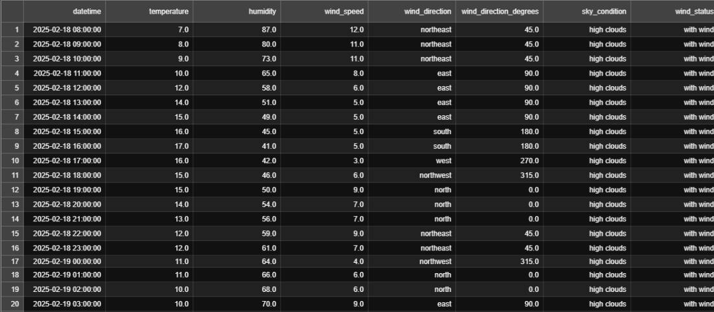
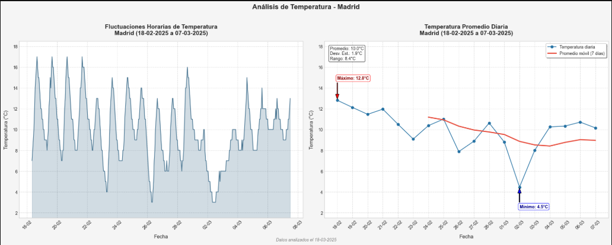
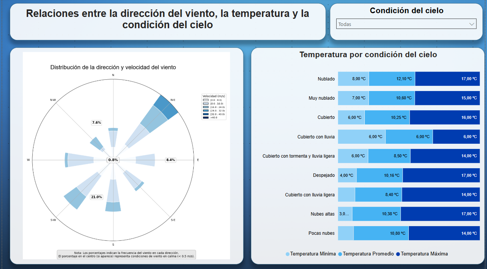

# Análisis Climático de Madrid

Este proyecto recopila, procesa y analiza datos meteorológicos de Madrid utilizando la API de AEMET (Agencia Estatal de Meteorología de España). El sistema completo permite obtener datos meteorológicos en tiempo real, procesarlos para su análisis y visualizarlos mediante distintas herramientas.

# Contexto del proyecto

Comencé a recolectar información meteorológica de Madrid el día 16 de febrero de 2025 a las 09:00 (GMT), utilizando un script programado para recolectar datos cada 6 horas mediante la API de OpenData AEMET.

El proceso de recolección se mantuvo activo hasta el día 05 de marzo de 2025 sobre las 05:00 (GMT), cuando noté problemas recurrentes con la conexión a la API, que he verificado como un problema de disponibilidad del servicio de OpenData AEMET. Además, para ese momento, consideré que ya había recopilado una cantidad de datos suficiente para llevar a cabo un análisis completo y detallado.

Esta recolección constante de datos me permitió disponer de un dataset robusto con el cual realizar la limpieza, transformación, análisis exploratorio y visualización de resultados utilizando herramientas como Python (Pandas, Matplotlib, Seaborn) y Power BI.

## Características

- Recolección automática de datos meteorológicos de la API de AEMET

- Limpieza y transformación de datos mediante procesos automatizados

- Análisis exploratorio a través de notebooks de Jupyter

- Visualización con gráficos y dashboard en Power BI

- Pruebas unitarias para asegurar la calidad del código

- Documentación detallada de cada componente

## Requisitos previos

- Python 3.8 o superior (Versión 3.12.5 usada para éste proyecto)

- Bibliotecas Python: pandas, numpy, requests, matplotlib, seaborn (ver requirements.txt)

- Clave API de AEMET (ver instrucciones abajo)

- Power BI Desktop Versión: 2.140.1577.0 64-bit (febrero de 2025) (opcional, para visualizar el dashboard)

## Estructura del proyecto

```
analisis-clima-madrid/
│
├── data/                         # Directorio de datos
│   ├── madrid_weather_forecast.csv   # Datos crudos recolectados
│   └── madrid_weather_clean.csv      # Datos procesados
│
├── notebooks/                    # Notebooks de análisis
│   ├── limpieza_datos.ipynb         # Proceso de limpieza de datos (desarrollo)
│   └── visualizacion_clima.ipynb    # Análisis visual del clima
│
├── madrid_weather_collector.py   # Script para recolectar datos de AEMET
├── limpieza_datos_clima.py       # Módulo de limpieza y procesamiento
├── probar_limpieza.py            # Script para verificar el proceso de limpieza
├── test_limpieza_datos_clima.py  # Pruebas unitarias para el módulo de limpieza
├── dashboard_clima_madrid.pbix   # Dashboard de Power BI
├── config_example.py             # Ejemplo de configuración (agregar API key)
├── README.md                     # Este archivo
└── requirements.txt              # Dependencias del proyecto
```

## Obtener una clave API de AEMET

Para utilizar este proyecto, necesitarás una clave API de AEMET:

1. Visita la página de [AEMET OpenData](https://opendata.aemet.es/centrodedescargas/inicio)
2. Haz clic en "Obtención de API Key"
3. Completa el formulario con tus datos y acepta los términos
4. Recibirás tu clave API en el correo electrónico proporcionado
5. Copia esta clave en el archivo `config.py` (ver instrucciones de instalación)

## Códigos INE de municipios

Este proyecto está configurado por defecto para Madrid (código INE: 28079), pero puedes adaptarlo a otros municipios:

1. Descarga el archivo Excel con los códigos INE desde la sección Acceso Desarrolladores/Documentación AEMET OpenData. HATEOAS de la página de [AEMET OpenData]
2. En el apartado "Predicciones específicas" al extender la opción "Predicción por municipio diaria. Tiempo actual" se observa un link que tiene los [datos de los códigos INE de los municipios](https://www.ine.es/daco/daco42/codmun/diccionario24.xlsx)
3. Al descargar el archivo vemos diversas columnas, debemos tomar los números de la columna "CPRO" (Codigo Provincia) y "CMUN" (Código Municipio) y concatenarlos para obtener el código correspondiente al municipio seleccionado.
4. Modifica el parámetro `municipality_code` en el script de recolección de datos.

## Instalación

1. Clona este repositorio:
   ```bash
   git clone https://github.com/tuusuario/analisis-clima-madrid.git
   cd analisis-clima-madrid
   ```

2. Instala las dependencias:
   ```bash
   pip install -r requirements.txt
   ```

3. Configura tu clave API:
   ```bash
   cp config_example.py config.py
   # Edita config.py y añade tu clave API
   ```

## Uso

### 1. Recolección de datos

Para recolectar datos meteorológicos de AEMET:

```bash
python madrid_weather_collector.py
```

Este script:
- Recopila datos meteorológicos para Madrid de la API de AEMET
- Guarda los datos en `data/madrid_weather_forecast.csv`
- Se ejecuta continuamente cada 6 horas (puedes modificar este intervalo)

Para detenerlo, presiona `Ctrl+C`.

### 2. Limpieza de datos

Para procesar los datos recolectados:

```bash
python probar_limpieza.py
```

Este script:
- Carga los datos recolectados
- Aplica las transformaciones de limpieza
- Guarda los datos procesados en `data/madrid_weather_clean.csv`
- Muestra estadísticas básicas del resultado

### 3. Análisis

Explora los notebooks en la carpeta `notebooks/` para:
- Entender el proceso de limpieza en detalle
- Ver análisis exploratorios de los datos
- Examinar gráficos y visualizaciones

### 4. Visualización en Power BI

Para visualizar el dashboard:
1. Abre el archivo `dashboard_clima_madrid.pbix` con Power BI Desktop
2. Si es necesario, actualiza la fuente de datos para que apunte a tu archivo `madrid_weather_clean.csv`

## Pruebas

Para ejecutar las pruebas unitarias:

```bash
python test_limpieza_datos_clima.py
```

Esto verificará que todas las funciones de limpieza y procesamiento funcionan correctamente.

## Flujo de trabajo completo

1. Ejecutar `madrid_weather_collector.py` para obtener datos
2. Ejecutar `probar_limpieza.py` para limpiar los datos
3. Explorar los notebooks para análisis
4. Visualizar los resultados en Power BI

## Hallazgos y Visualizaciones

Durante el análisis de los datos meteorológicos de Madrid, se encontraron varios patrones interesantes:

### Datos Procesados

*Muestra del conjunto de datos después del proceso de limpieza y transformación*

### Análisis Exploratorio

*Gráfico de la evolución de temperaturas máximas y mínimas durante el período analizado*

### Dashboard Interactivo

*Parte del dashboard para la visualización interactiva de los datos meteorológicos*

Para acceder a todas las visualizaciones y análisis detallados, consulta los notebooks en la carpeta `notebooks/` o abre el archivo de Power BI.

## Propósito del Proyecto

Este proyecto ha sido desarrollado con fines educativos y como parte de un portafolio personal para demostrar habilidades en análisis de datos, manipulación de datos con Python, uso de GitHub para control de versiones, y visualización de datos con Power BI. No se pretende un uso comercial ni se busca lucrar con la información proporcionada por la Agencia Estatal de Meteorología (AEMET).

## Créditos y referencias

Este proyecto utiliza información elaborada por la Agencia Estatal de Meteorología a través de su servicio OpenData. Los datos están sujetos a los términos y condiciones establecidos por AEMET, que pueden encontrarse en su sitio web oficial: [Nota Legal de AEMET](https://www.aemet.es/es/nota_legal)


Este repositorio de código se distribuye bajo la licencia MIT. Consulta el archivo LICENSE para más detalles.

## Contacto

Leonardo Leal Vivas

[ljlv81@gmail.com](mailto:ljlv81@gmail.com)

GitHub: [LeonardoLeal08](https://github.com/LeonardoLeal08?tab=repositories)

